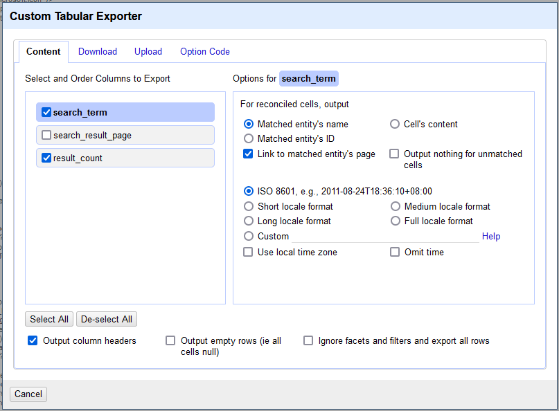
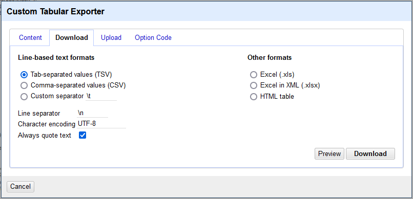
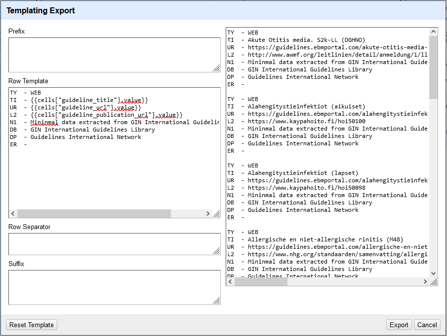

Search Guidelines International Network library
==============================================================================

The [GIN international guideline library](https://g-i-n.net/international-guidelines-library/) and registry of guidelines in development has very limited search functions. The [documentation](https://g-i-n.net/wp-content/uploads/2021/09/Guide-to-GIN-library-and-registry-of-guidelines-in-development-September-2021-for-website.pdf) says "The library has been designed to use natural language; specifically, it does not use Boolean operators or wildcards." This is not ideal when many alternative terms must be searched as for systematic reviews or guideline development. For each of these terms a new search statement has to be entered. There is no search history. Search results can be added to a "Saved list" after registration. But this has to be done for every record individually and takes 3 clicks each time. I found no means to download records in a useful bibliographic format. Not for an individual record nor for a "Saved list" or a list of search results.


Starting with a list of search terms we search GIN library using OpenRefine. An individual search request is created for each search term, result pages are downloaded and record data extracted by web scraping.


## Search terms

An example of a list of search terms, each term on its own line:

```

search_term
nasal
nose
sinonasal

```

Start a new project in OpenRefine. Paste the search terms from the clipboard or load a text file. The column with the search terms must be named `search_term`. I found ti easiest to add the column name as the first line and then choose TSV file format.


## Search GIN library

OpenRefine code to carry out the searches:


```json

[
  {
    "op": "core/column-addition-by-fetching-urls",
    "engineConfig": {
      "facets": [],
      "mode": "row-based"
    },
    "baseColumnName": "search_term",
    "urlExpression": "grel:\"https://guidelines.ebmportal.com/guidelines-international-network?search=\" + value + \"&type=search\"",
    "onError": "set-to-blank",
    "newColumnName": "search_result_page",
    "columnInsertIndex": 1,
    "delay": 5000,
    "cacheResponses": true,
    "httpHeadersJson": [
      {
        "name": "authorization",
        "value": ""
      },
      {
        "name": "user-agent",
        "value": "OpenRefine 3.5.2 [e3efd4e]"
      },
      {
        "name": "accept",
        "value": "*/*"
      }
    ],
    "description": "Create column search_result_page at index 1 by fetching URLs based on column search_term using expression grel:\"https://guidelines.ebmportal.com/guidelines-international-network?search=\" + value + \"&type=search\""
  }
]

```

Extract the result count for each search:


```json

[
  {
    "op": "core/column-addition",
    "engineConfig": {
      "facets": [],
      "mode": "row-based"
    },
    "baseColumnName": "search_result_page",
    "expression": "grel:value.parseHtml().select(\"div.large-9.main.columns p\")[0].htmlText().toString().replace(\" Result(s) Found\", \"\").toNumber()",
    "onError": "set-to-blank",
    "newColumnName": "result_count",
    "columnInsertIndex": 2,
    "description": "Create column result_count at index 2 based on column search_result_page using expression grel:value.parseHtml().select(\"div.large-9.main.columns p\")[0].htmlText().toString().replace(\" Result(s) Found\", \"\").toNumber()"
  }
]

```


## Export search history

At this stage it is convenient to export a search history from OpenRefine, e.g. search terms and their record counts. 

Use the Custom Tabular Exporter to export to a tsv-file:





## Extract record data

It is somewhat of a pain to extract bibliographic data from the web pages due to the representation in the HTML. So we just extract some minimal data about the guidelines: Title, URL in GIN library and the URL of the published or registered guideline.

```json

[
  {
    "op": "core/column-addition",
    "engineConfig": {
      "facets": [],
      "mode": "row-based"
    },
    "baseColumnName": "search_result_page",
    "expression": "grel:forEach(value.parseHtml().select(\"h5.title.item-block-title a.notranslate\"), v, v.htmlAttr(\"title\")).join(\"|||\")",
    "onError": "set-to-blank",
    "newColumnName": "guideline_title",
    "columnInsertIndex": 2,
    "description": "Create column guideline_title at index 2 based on column search_result_page using expression grel:forEach(value.parseHtml().select(\"h5.title.item-block-title a.notranslate\"), v, v.htmlAttr(\"title\")).join(\"|||\")"
  },
  {
    "op": "core/column-addition",
    "engineConfig": {
      "facets": [],
      "mode": "row-based"
    },
    "baseColumnName": "search_result_page",
    "expression": "grel:forEach(value.parseHtml().select(\"h5.title.item-block-title a.notranslate\"), v, \"https://guidelines.ebmportal.com\" + v.htmlAttr(\"href\")).join(\"|||\")",
    "onError": "set-to-blank",
    "newColumnName": "guideline_url",
    "columnInsertIndex": 2,
    "description": "Create column guideline_url at index 2 based on column search_result_page using expression grel:forEach(value.parseHtml().select(\"h5.title.item-block-title a.notranslate\"), v, \"https://guidelines.ebmportal.com\" + v.htmlAttr(\"href\")).join(\"|||\")"
  },
  {
    "op": "core/column-addition",
    "engineConfig": {
      "facets": [],
      "mode": "row-based"
    },
    "baseColumnName": "search_result_page",
    "expression": "grel:forEach(value.parseHtml().select(\"div.eresources-items.row.collapse div.columns.medium-3.large-3 a:first-of-type\"), v, v.htmlAttr(\"href\")).join(\"|||\")",
    "onError": "set-to-blank",
    "newColumnName": "guideline_publication_url",
    "columnInsertIndex": 2,
    "description": "Create column guideline_publication_url at index 2 based on column search_result_page using expression grel:forEach(value.parseHtml().select(\"div.eresources-items.row.collapse div.columns.medium-3.large-3 a:first-of-type\"), v, v.htmlAttr(\"href\")).join(\"|||\")"
  }
]

```

Split multi-valued cells:

```json

[
  {
    "op": "core/multivalued-cell-split",
    "columnName": "guideline_title",
    "keyColumnName": "search_term",
    "mode": "separator",
    "separator": "|||",
    "regex": false,
    "description": "Split multi-valued cells in column guideline_title"
  },
  {
    "op": "core/multivalued-cell-split",
    "columnName": "guideline_url",
    "keyColumnName": "search_term",
    "mode": "separator",
    "separator": "|||",
    "regex": false,
    "description": "Split multi-valued cells in column guideline_url"
  },
  {
    "op": "core/multivalued-cell-split",
    "columnName": "guideline_publication_url",
    "keyColumnName": "search_term",
    "mode": "separator",
    "separator": "|||",
    "regex": false,
    "description": "Split multi-valued cells in column guideline_publication_url"
  }
]

```

We are still in records mode with each search term being a record. Now we distill the data down to individual guidelines. This way we go from records mode to row mode.

```json

[
  {
    "op": "core/column-removal",
    "columnName": "search_result_page",
    "description": "Remove column search_result_page"
  },
  {
    "op": "core/column-removal",
    "columnName": "result_count",
    "description": "Remove column result_count"
  },
  {
    "op": "core/column-removal",
    "columnName": "search_term",
    "description": "Remove column search_term"
  }
]

```


Then we deduplicate the guidelines along [this guide](https://guides.library.illinois.edu/openrefine/duplicates). We use the guideline_url column to deduplicate.


```json

[
  {
    "op": "core/column-move",
    "columnName": "guideline_url",
    "index": 0,
    "description": "Move column guideline_url to position 0"
  },
  {
    "op": "core/row-reorder",
    "mode": "row-based",
    "sorting": {
      "criteria": [
        {
          "valueType": "string",
          "column": "guideline_url",
          "blankPosition": 2,
          "errorPosition": 1,
          "reverse": false,
          "caseSensitive": true
        }
      ]
    },
    "description": "Reorder rows"
  },
  {
    "op": "core/row-removal",
    "engineConfig": {
      "facets": [
        {
          "type": "list",
          "name": "guideline_url",
          "expression": "isBlank(value)",
          "columnName": "guideline_url",
          "invert": false,
          "omitBlank": false,
          "omitError": false,
          "selection": [
            {
              "v": {
                "v": true,
                "l": "true"
              }
            }
          ],
          "selectBlank": false,
          "selectError": false
        }
      ],
      "mode": "row-based"
    },
    "description": "Remove rows"
  },
  {
    "op": "core/blank-down",
    "engineConfig": {
      "facets": [],
      "mode": "row-based"
    },
    "columnName": "guideline_url",
    "description": "Blank down cells in column guideline_url"
  },
  {
    "op": "core/row-removal",
    "engineConfig": {
      "facets": [
        {
          "type": "list",
          "name": "guideline_url",
          "expression": "isBlank(value)",
          "columnName": "guideline_url",
          "invert": false,
          "omitBlank": false,
          "omitError": false,
          "selection": [
            {
              "v": {
                "v": true,
                "l": "true"
              }
            }
          ],
          "selectBlank": false,
          "selectError": false
        }
      ],
      "mode": "row-based"
    },
    "description": "Remove rows"
  }
]

```

## Export of guideline data

Now we can export the deduplicated guideline records.

### Export data to a RIS file using the Templating Export

Empty Prefix & Suffix. Make sure to have an empty line in the Row Separator so that the records are separated.

Row Remplate:

```bash 

TY  - WEB
TI  - {{cells["guideline_title"].value}}
UR  - {{cells["guideline_url"].value}}
L2  - {{cells["guideline_publication_url"].value}}
N1  - Mininmal data extracted from GIN International Guidelines Library
DB  - GIN International Guidelines Library
DP  - Guidelines International Network
ER  - 

```




Resulting [RIS-file](data/GIN/GIN_search-results.RIS).


