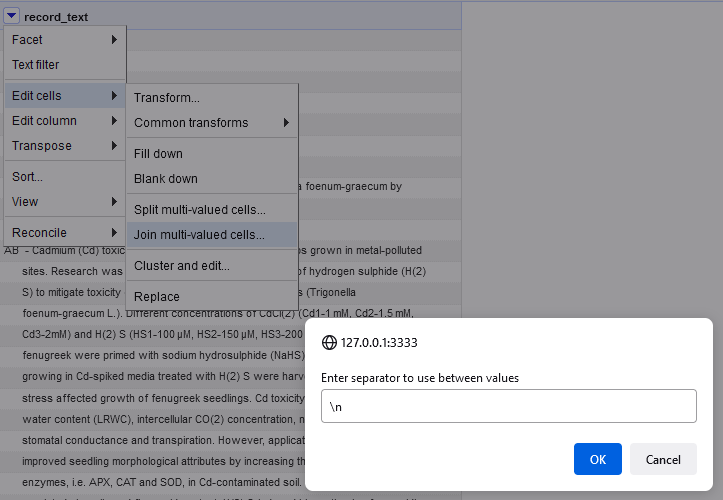

Search for stopwords and special characters
==============================================================================

Some things cannot be searched for in PubMed itself such as [stopwords](https://pubmed.ncbi.nlm.nih.gov/help/#help-stopwords) and [certain characters](https://pubmed.ncbi.nlm.nih.gov/help/#character-conversions) that either have a special meaning in searches or are converted to spaces during indexing and searching.

Sometimes, it may be possible to circumvent this problem by downloading a larger set of records that can then be searched/filtered for relevant records locally.

Remark: This is a partial adaptation of the [same approach using command line tools](https://github.com/knh11545/commandline4expertsearchers/blob/master/search_PubMed4minus.md) to OpenRefine.


## Example: Search for CD21 negative in PubMed when negative is symbolized with a minus character

* Search `CD21[tw]` (text words) in PubMed.
* Download the 2389 records (as of 2022-02-08) in PubMed format to a file [pubmed-CD21tw-set.txt](data/pubmed-CD21tw-set.txt).
* Create a new project in OpenRefine. Get data from "This Computer". Choose the the PubMed file to upload.
* Parse data as "Line-based text files". Choose these settings:


We have now a single column called "Column 1" with 221077 rows in the project. Every row contains a single line of the original text file. First, we will rename th column to a more useful name, e.g. `record_text`:


But we don't want just many individual lines. We want to have the PubMed records as records in OpenRefine, too. We need to do this stepwise.  Every record starts with a line that begins with `PMID- ` and contains the PMID of the record. We extract the PMID into a new column: 


* New column name: PMID
* We use the GREL function [match](https://docs.openrefine.org/manual/grelfunctions#matchs-p) and a regular expression: 

```grel
value.match(/^PMID- (\d+)$/)[0]
```


Now, all rows containing the PMID of a record will contain the PMID in the `PMID` column. All other rows in the `PMID` column are blank.

We need to move the PMID column to the beginning so that OpenRefine will accept it to order our data:


Our first column is now the PMID column. Make sure you show data as rows for the next step:


Join the lines belonging to a record. We use "\n" as a separator between the original lines:



"\n" ususally is interpreted as a newline character. But it is interpreted literally in this case. So we replace it with a newline character with the replace function:

```grel
value.replace(/\\n/,"\n")
```


Now we have our PubMed records nicely formatted in a single cell and each record in a single row. This makes a total of 2389 rows = records:


Now we need to search the records. We will use a [regular expression](https://docs.openrefine.org/manual/expressions#regular-expressions) to find variants of the concept _CD21 negative_:

```grel 
value.find(/CD21[(]*-\S*/i)
```

We create a new column that will contain the matching text patterns found in the column record_text:


Them we enter the GREL code to find the desired text and put it into column CD21-words. 

We have to overcome a difficulty, here. The [`find()` function](https://docs.openrefine.org/manual/grelfunctions#finds-sub-or-p) returns an array of the matching substrings. We need to convert this aray to a string by joining all the strings in the array with the [`join()` function](https://docs.openrefine.org/manual/grelfunctions#joina-sep). As separator we use the newline character (a quoted special character: "\n") so that every matching entry will be on its own line:

 

A record may contain the same matching substring multiple times. We reduce these to a single copy of each substring in each record by applying the [`uniques()` function](https://docs.openrefine.org/manual/grelfunctions#uniquesa) to the array returned by `find()`. So it is actually the result of `uniques()` that will be joined into a single string. The code with some formatting applied:

```grel

forEach(
  value.find(/CD21[(]*-\S*/i).uniques(),
  v,
  v
).join("\n")

```

Beware: This will also yield text where the minus character is actually a hyphen, such as in "CD21-positive".

Many of the cells in CD21-words are empty. These PubMed records don't contain matching text. Remember we searched for `CD21[tw]` in PubMed. These are the records that we would like to exclude. To do this we use a text facet on the CD21-words column:


The facet reveals that 2086 records (out of our total of 2389) do not match our search. But there are 129 other choices:


We _include_ the "blank" choice and the one that only contains "CD21-positive" (with 27 matching cells). Then we _invert_ that selection at the top of the facet window. We end up with _294 matching rows_ as indicated at the top of our table:


We can now export the matching PubMed records to a text file. For this use `Export > Templating...` in the upper right corner.

The _Row Template_ should contain: 

```
{{cells["record_text"].value}}
```

The templates for _Prefix_ and _Suffix_ must be empty. The _Row Separator_ field must contain (invisible) newline characters such that the records are separated by empty lines. Just hit `Enter` twice. This can be checked in the preview of the export file: 


With these settings we only export the cells' content of the record_text column, i.e. the PubMed records as they were. The resulting text file in PubMed format is [here](data/CD21-minus-from-OpenRefine_PubMed.txt).

This PubMed-/nbib-file is nicely imported by Endnote.

As an alternative, it is possible to just export the PMIDs. Use the custom tabular exporter...

### Code for OpenRefine

This can be pasted and applied in the `Undo / Redo` tab:

```json

[
  {
    "op": "core/column-rename",
    "oldColumnName": "Column 1",
    "newColumnName": "record_text",
    "description": "Rename column Column 1 to record_text"
  },
  {
    "op": "core/column-addition",
    "engineConfig": {
      "facets": [],
      "mode": "row-based"
    },
    "baseColumnName": "record_text",
    "expression": "grel:value.match(/^PMID- (\\d+)$/)[0]",
    "onError": "set-to-blank",
    "newColumnName": "PMID",
    "columnInsertIndex": 1,
    "description": "Create column PMID at index 1 based on column record_text using expression grel:value.match(/^PMID- (\\d+)$/)[0]"
  },
  {
    "op": "core/column-move",
    "columnName": "PMID",
    "index": 0,
    "description": "Move column PMID to position 0"
  },
  {
    "op": "core/multivalued-cell-join",
    "columnName": "record_text",
    "keyColumnName": "PMID",
    "separator": "\\n",
    "description": "Join multi-valued cells in column record_text"
  },
  {
    "op": "core/text-transform",
    "engineConfig": {
      "facets": [],
      "mode": "row-based"
    },
    "columnName": "record_text",
    "expression": "grel:value.replace(/\\\\n/,\"\\n\")",
    "onError": "keep-original",
    "repeat": false,
    "repeatCount": 10,
    "description": "Text transform on cells in column record_text using expression grel:value.replace(/\\\\n/,\"\\n\")"
  },
  {
    "op": "core/column-addition",
    "engineConfig": {
      "facets": [],
      "mode": "row-based"
    },
    "baseColumnName": "record_text",
    "expression": "grel:forEach(\n  value.find(/CD21[(]*-\\S*/i).uniques(),\n  v,\n  v\n).join(\"\\n\")",
    "onError": "set-to-blank",
    "newColumnName": "CD21-words",
    "columnInsertIndex": 2,
    "description": "Create column CD21-words at index 2 based on column record_text using expression grel:forEach(\n  value.find(/CD21[(]*-\\S*/i).uniques(),\n  v,\n  v\n).join(\"\\n\")"
  }
]

```


