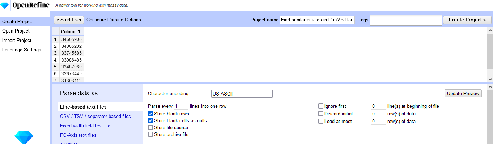

Fetch similar articles
==============================================================================

Fetch the *similar articles* for a number of PubMed records.

The new (as of 2020) PubMed only allows to retrieve the similar articles for a single record. If the similar articles for a number of articles is needed collecting them becomes a tedious process:

1. Every source article needs to be visited/searched individually and viewed individually. Only then the "Similar articles" function is available.
2. The end of "Similar articles" section must be located and the "See all similar articles" link must be clicked. This will yield an entry in the search history with the corresponding record set.
3. The search statements with the similar articles need to be combined with OR to get a record set of all similar articles. These are deduplicated an can be downloaded.

If the PMIDs of the source records are available it is possible to build a URL that will retrieve the similar articles as a search statement. This might help as a shortcut of the steps 1 and 2 above:

Example: <https://pubmed.ncbi.nlm.nih.gov/?linkname=pubmed_pubmed&from_uid=34665900>

However, only a single PMID may be used in creating such a link.

For updates the whole manual process must be started again.


## Use OpenRefine


1. Start with a text file with the PMIDs of the source articles. Every PMID on its own line. PubMed will create such a file when downloading a set of records in PMID format. A sample file is [here](data/PMID4similar_articles.txt).
2. In OpenRefine: `Create Project` > `Get data from This Computer`. Browse to the file with the source PMIDs. Click `Next >>`.
3. Use these settings, then click `Create Project >>`:



4. Go to the `Undo / Redo` tab, click `Apply` and paste the code below. Click `Perform Operations`.
5. Export the similar articles and/or their PMIDs as described below.

Note: How to [join cells in a column](https://onlinejournalismblog.com/2014/05/30/how-to-combine-multiple-rows-in-a-dataset-where-text-is-split-across-them-open-refine/)


### OpenRefine code

Known bugs:

* Does currently not work for more than 1000 similar articles: Will fetch only the first 1000 records.

```json

[
  {
    "op": "core/column-rename",
    "oldColumnName": "Column 1",
    "newColumnName": "PMID source records",
    "description": "Rename column Column 1 to PMID source records"
  },
  {
    "op": "core/column-addition",
    "engineConfig": {
      "facets": [],
      "mode": "row-based"
    },
    "baseColumnName": "PMID source records",
    "expression": "grel:1",
    "onError": "set-to-blank",
    "newColumnName": "tmp",
    "columnInsertIndex": 1,
    "description": "Create column tmp at index 1 based on column PMID source records using expression grel:1"
  },
  {
    "op": "core/column-move",
    "columnName": "tmp",
    "index": 0,
    "description": "Move column tmp to position 0"
  },
  {
    "op": "core/blank-down",
    "engineConfig": {
      "facets": [],
      "mode": "row-based"
    },
    "columnName": "tmp",
    "description": "Blank down cells in column tmp"
  },
  {
    "op": "core/multivalued-cell-join",
    "columnName": "PMID source records",
    "keyColumnName": "tmp",
    "separator": ",",
    "description": "Join multi-valued cells in column PMID source records"
  },
  {
    "op": "core/column-addition-by-fetching-urls",
    "engineConfig": {
      "facets": [],
      "mode": "row-based"
    },
    "baseColumnName": "PMID source records",
    "urlExpression": "grel:\"https://eutils.ncbi.nlm.nih.gov/entrez/eutils/epost.fcgi?tool=OpenRefine&db=pubmed&usehistory=y&id=\" + value",
    "onError": "set-to-blank",
    "newColumnName": "epost",
    "columnInsertIndex": 2,
    "delay": 5000,
    "cacheResponses": true,
    "httpHeadersJson": [
      {
        "name": "authorization",
        "value": ""
      },
      {
        "name": "user-agent",
        "value": "OpenRefine 3.5.2 [e3efd4e]"
      },
      {
        "name": "accept",
        "value": "*/*"
      }
    ],
    "description": "Create column epost at index 2 by fetching URLs based on column PMID source records using expression grel:\"https://eutils.ncbi.nlm.nih.gov/entrez/eutils/epost.fcgi?tool=OpenRefine&db=pubmed&usehistory=y&id=\" + value"
  },
  {
    "op": "core/column-addition-by-fetching-urls",
    "engineConfig": {
      "facets": [],
      "mode": "row-based"
    },
    "baseColumnName": "epost",
    "urlExpression": "grel:\"https://eutils.ncbi.nlm.nih.gov/entrez/eutils/elink.fcgi?tool=OpenRefine&dbfrom=pubmed&db=pubmed&linkname=pubmed_pubmed&cmd=neighbor_history&WebEnv=\" + \nvalue.parseXml().select(\"WebEnv\")[0].xmlText().toString() + \n\"&query_key=\" +\nvalue.parseXml().select(\"QueryKey\")[0].xmlText().toString()",
    "onError": "set-to-blank",
    "newColumnName": "elink",
    "columnInsertIndex": 3,
    "delay": 5000,
    "cacheResponses": true,
    "httpHeadersJson": [
      {
        "name": "authorization",
        "value": ""
      },
      {
        "name": "user-agent",
        "value": "OpenRefine 3.5.2 [e3efd4e]"
      },
      {
        "name": "accept",
        "value": "*/*"
      }
    ],
    "description": "Create column elink at index 3 by fetching URLs based on column epost using expression grel:\"https://eutils.ncbi.nlm.nih.gov/entrez/eutils/elink.fcgi?tool=OpenRefine&dbfrom=pubmed&db=pubmed&linkname=pubmed_pubmed&cmd=neighbor_history&WebEnv=\" + \nvalue.parseXml().select(\"WebEnv\")[0].xmlText().toString() + \n\"&query_key=\" +\nvalue.parseXml().select(\"QueryKey\")[0].xmlText().toString()"
  },
  {
    "op": "core/column-addition-by-fetching-urls",
    "engineConfig": {
      "facets": [],
      "mode": "row-based"
    },
    "baseColumnName": "elink",
    "urlExpression": "grel:\"https://eutils.ncbi.nlm.nih.gov/entrez/eutils/efetch.fcgi?tool=OpenRefine&db=pubmed&retmode=text&rettype=medline&retmax=10000&WebEnv=\" + \nvalue.parseXml().select(\"WebEnv\")[0].xmlText().toString() + \n\"&query_key=\" +\nvalue.parseXml().select(\"QueryKey\")[0].xmlText().toString()",
    "onError": "set-to-blank",
    "newColumnName": "efetch",
    "columnInsertIndex": 4,
    "delay": 5000,
    "cacheResponses": true,
    "httpHeadersJson": [
      {
        "name": "authorization",
        "value": ""
      },
      {
        "name": "user-agent",
        "value": "OpenRefine 3.5.2 [e3efd4e]"
      },
      {
        "name": "accept",
        "value": "*/*"
      }
    ],
    "description": "Create column efetch at index 4 by fetching URLs based on column elink using expression grel:\"https://eutils.ncbi.nlm.nih.gov/entrez/eutils/efetch.fcgi?tool=OpenRefine&db=pubmed&retmode=text&rettype=medline&retmax=10000&WebEnv=\" + \nvalue.parseXml().select(\"WebEnv\")[0].xmlText().toString() + \n\"&query_key=\" +\nvalue.parseXml().select(\"QueryKey\")[0].xmlText().toString()"
  },
  {
    "op": "core/column-addition",
    "engineConfig": {
      "facets": [],
      "mode": "row-based"
    },
    "baseColumnName": "efetch",
    "expression": "grel:forEach(value.find(/PMID- \\d+/), v, v.replace(\"PMID- \", \"\")).length()",
    "onError": "set-to-blank",
    "newColumnName": "similar articles count",
    "columnInsertIndex": 5,
    "description": "Create column similar articles count at index 5 based on column efetch using expression grel:forEach(value.find(/PMID- \\d+/), v, v.replace(\"PMID- \", \"\")).length()"
  },
  {
    "op": "core/column-addition",
    "engineConfig": {
      "facets": [],
      "mode": "row-based"
    },
    "baseColumnName": "efetch",
    "expression": "grel:forEach(value.find(/PMID- \\d+/), v, v.replace(\"PMID- \", \"\")).join(\"\\n\")",
    "onError": "set-to-blank",
    "newColumnName": "PMID similar articles",
    "columnInsertIndex": 5,
    "description": "Create column PMID similar articles at index 5 based on column efetch using expression grel:forEach(value.find(/PMID- \\d+/), v, v.replace(\"PMID- \", \"\")).join(\"\\n\")"
  }
]

```


### Download result in PubMed/nbib-format

`Export` > `Custom Tabular Exporter` > `Option Code`:

```json

{
  "format": "tsv",
  "separator": "\t",
  "lineSeparator": "\n",
  "encoding": "UTF-8",
  "quoteAll": false,
  "outputColumnHeaders": false,
  "outputBlankRows": false,
  "columns": [
    {
      "name": "efetch",
      "reconSettings": {
        "output": "entity-name",
        "blankUnmatchedCells": false,
        "linkToEntityPages": true
      },
      "dateSettings": {
        "format": "iso-8601",
        "useLocalTimeZone": false,
        "omitTime": true
      }
    }
  ]
}

```

The resulting [tsv-file](data/similar-articles.tsv) is a text file that has a superfluous quote charcter in the first and in the last line. This is due to the fact that we export a single quoted cell of a table. These quote characters or lines should be removed before importing the file into other software as they may interfere. This can be done manually in a text editor or scripted:

```bash 
sed -e '1d;$d' data/similar-articles.tsv > data/similar-articles.nbib
```

We now have a file with all similar articles in proper PubMed-format: [data/similar-articles.nbib](data/similar-articles.nbib)


### Download result in PubMed/nbib-format

`Export` > `Custom Tabular Exporter` > `Option Code`:

```json

{
  "format": "tsv",
  "separator": "\t",
  "lineSeparator": "\n",
  "encoding": "UTF-8",
  "quoteAll": false,
  "outputColumnHeaders": false,
  "outputBlankRows": false,
  "columns": [
    {
      "name": "PMID similar articles",
      "reconSettings": {
        "output": "entity-name",
        "blankUnmatchedCells": false,
        "linkToEntityPages": true
      },
      "dateSettings": {
        "format": "iso-8601",
        "useLocalTimeZone": false,
        "omitTime": false
      }
    }
  ]
}

```

Remove superfluous quotes:

```bash 
sed -e 's/"//g' data/similar-articles-pmid.tsv > data/similar-articles-pmid.txt
```

We now have a text file with the PMIDs of all similar articles: [data/similar-articles-pmid.txt](data/similar-articles-pmid.txt)

